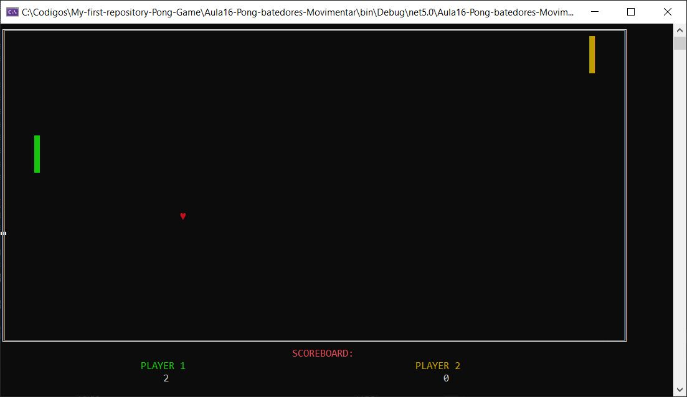

# **My First Repository** - **PONG GAME**

Hello, This is my first repository :)

I'm learning C#, so my goal with this game was to practice this language.

## *How To Play*:
Use the following keys to move the Players. Press the key according to direction that you want to go.

**Player 1 (Left):**

1. **Q** -> Go Up

2. **A** -> Go Down

**Player 2 (Right):**

1. **P** -> Go Up

2. **L** -> Go Down

## *The Result:*

